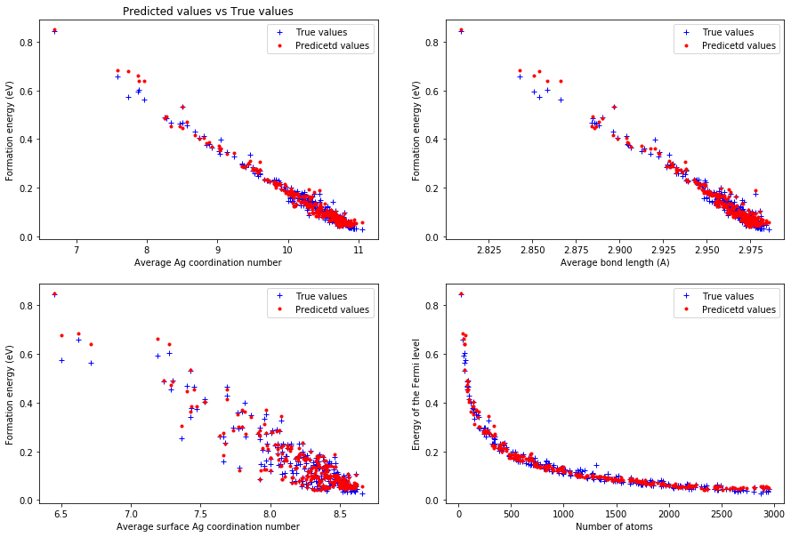

# Predicting Ag nanoparticles properties with Machine Learning from DFTB calculations
Keywords: DFT, Machine Learning, Nanoparticles, Materials Science.

Author: Jorge Salmon

## Introduction

Density functional theory (DFT) is a computational quantum mechanical modelling method used in physics, chemistry and materials science to investigate the electronic structure (or nuclear structure) of many-body systems, in particular atoms, molecules, and the condensed phases. Using this theory, the properties of a many-electron system can be determined by using functionals, i.e. functions of another function, which in this case is the spatially dependent electron density. Hence the name density functional theory comes from the use of functionals of the electron density. 

## The problem

Despite of being a powerful tool, DFT has a series of drawbacks and limitations. One of many is the computational limitations when it comes to calculating systems made up of hundreds of atoms. Supercomputers are needed to treat up to thousands of atoms in DFT. 

## The solution

One of the potential solutions to this problem is using Machine Learning methods to estimate values of the properties of many-atoms systems, without having run a DFT calculation. Here, I use Random Forest Regression to predict the values of Formation Energy of 277 silver (Ag) nanoparticles of different sizes, with up to ~3000 atoms.  For this, a training dataset of 148 Ag nanoparticles calculated using Density Functional Tight Binding was used. The original dataset, comprised of 425 Ag nanoparticles was calculated by Amanda Barnard et al. (Barnard, Amanda; Sun, Baichuan; Motevalli Soumehsaraei, Benyamin; Opletal, George (2017): Silver Nanoparticle Data Set. v3. CSIRO. Data Collection. https://doi.org/10.25919/5d22d20bc543e).

## Methods

The model was implemented using Python. Firstly, the original dataset was randomly split into two sets: the validation set, containing the information of 277 Ag nanoparticles, and the training set, having the information of the rest nanoparticles (148 nanoparticles). The samples in the resultant datasets were shuffled as a result of the random split. It was found that the relevant features of the dataset were the number of atoms, average Ag coordination number, average bond length and average surface Ag coordination number. This features are enough to determine the size and shape of a nanoparticle (dataset headers included in the .pdf file). 5-Fold Cross-validation was carried out for the training dataset with two different models: Random Forest Regressor and K Nearest Neighbors Regressor from Scikit-learn (https://scikit-learn.org/stable/index.html). The Random Forest estimator with 10 n_estimators performed the best, scoring an average accuracy of 0.93 +/- 0.15. Finally, the model was trained with the whole training dataset, and used to predict the formation energy of the 425 Ag nanoparticles, giving a Mean Absolute Error of 0.01.

## Key result

As shown in the Figure below, the predicted values of Formation energy are in close agreement with the true values calculated with DFT.

## Code

The code and results can be found in the Jupiter Notebook located in this repository (Ag_NPs_code), or click here to see it https://github.com/Jorge-Salmon/Ag-nanoparticles-DFT/blob/master/Ag_NPs_code.ipynb

## Conclusion

It was shown that by using Machine learning it was able to predict values of properties related to nanosized materials. Furthermore, the set of predicted values was larger than the size of the training set used. This technique is useful to aid DFT calculate properties of systems with large number of atoms. 

